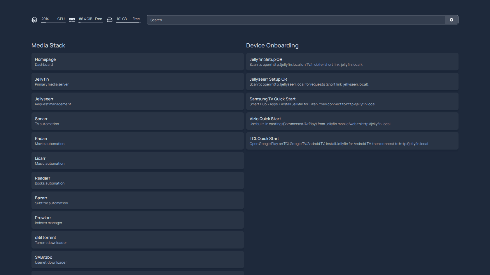
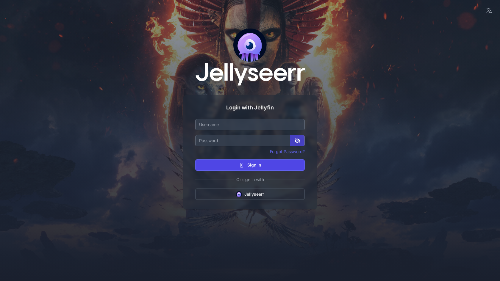

# Getting Started

Go from zero to streaming in one command. This guide covers installation, requesting your first movie, connecting your TV, and enabling automatic downloads.

## Prerequisites

You need **one** of these:

| Platform | Requirements |
|---|---|
| **Linux** (recommended) | Docker Engine 24+ or Kubernetes (MicroK8s, k3s, etc.) |
| **macOS** | Docker Desktop with Compose V2 |
| **Windows** | WSL2 + Docker Desktop, or WSL2 + MicroK8s |

All platforms need: **Git**, **Python 3.11+**, and at least **50 GB free disk space**.

### Linux (Docker Compose)
```bash
# Install Docker if you don't have it
curl -fsSL https://get.docker.com | sh
sudo usermod -aG docker $USER
# Log out and back in, then:
docker compose version   # verify v2.20+
```

### Linux (Kubernetes / MicroK8s)
```bash
sudo snap install microk8s --classic
microk8s enable dns storage ingress
alias kubectl="microk8s kubectl"
```

### macOS
Install [Docker Desktop](https://www.docker.com/products/docker-desktop/) and enable Kubernetes in Settings if you want the K8s path. Otherwise Compose works out of the box.

### Windows
Install [WSL2](https://learn.microsoft.com/en-us/windows/wsl/install) + [Docker Desktop](https://www.docker.com/products/docker-desktop/) with WSL2 backend. Run all commands inside WSL2 (Ubuntu recommended).

---

## Step 1: Clone and Deploy

```bash
git clone https://github.com/mploschiavo/mediaserver.git
cd mediaserver
```

### Option A: Docker Compose (simplest)

**Linux / macOS:**
```bash
./deploy-compose.sh
```

**Any OS (cross-platform):**
```bash
python deploy.py compose
```

**Manual (step-by-step):**
```bash
docker compose -f docker/docker-compose.yml up -d
# Wait for bootstrap to be healthy, then trigger:
curl -X POST http://127.0.0.1:9100/actions/bootstrap -H "Content-Type: application/json" -d "{}"
```

### Option B: Kubernetes

**Linux / macOS:**
```bash
./deploy-k8s.sh
```

**Any OS (cross-platform):**
```bash
python deploy.py k8s
```

**Manual (step-by-step):**
```bash
kubectl create namespace media-dev
kubectl apply -k k8s/profiles/standard
kubectl -n media-dev create configmap media-stack-controller-config \
  --from-file=config.json=contracts/media-stack.config.json --dry-run=client -o yaml | kubectl apply -f -
kubectl -n media-dev create configmap media-stack-controller-profile \
  --from-file=profile.yaml=examples/bootstrap-profiles/media-k8s-standard.yaml --dry-run=client -o yaml | kubectl apply -f -
# Wait for pods, then trigger bootstrap:
kubectl -n media-dev port-forward svc/media-stack-controller 9100:9100 &
curl -X POST http://127.0.0.1:9100/actions/bootstrap -H "Content-Type: application/json" -d "{}"
```

That's it. The deploy script:
1. Starts all services (Jellyfin, Sonarr, Radarr, Prowlarr, qBittorrent, and 15+ more)
2. Waits for everything to be healthy
3. Triggers the controller service to auto-configure all apps
4. Prints the dashboard URL when done

Bootstrap takes 3-5 minutes. Watch progress at the dashboard:
- **Compose:** http://localhost:9100/
- **K8s:** `kubectl -n media-dev port-forward svc/media-stack-controller 9100:9100` then http://localhost:9100/

---

## Step 2: Access Your Stack

### DNS Setup

Add these to your `/etc/hosts` file (Linux/Mac) or `C:\Windows\System32\drivers\etc\hosts` (Windows):

**Compose (localhost):**
```
127.0.0.1  apps.media-stack.local jellyfin.media-stack.local homepage.media-stack.local
```

**Kubernetes (replace with your node IP):**
```
192.168.1.60  apps.media-dev.local jellyfin.media-dev.local homepage.media-dev.local
```

Or generate the full list automatically:
```bash
bash bin/render-hosts-example.sh <NODE_IP> <NAMESPACE>
```

### Open the Dashboard

| Service | Compose URL | K8s URL (port 30180) |
|---|---|---|
| **Homepage** (start here) | http://apps.media-stack.local/app/homepage | http://apps.media-dev.local:30180/app/homepage |
| **Jellyfin** (watch stuff) | http://jellyfin.media-stack.local | http://jellyfin.media-dev.local:30180 |
| **Jellyseerr** (request stuff) | http://apps.media-stack.local/app/jellyseerr | http://apps.media-dev.local:30180/app/jellyseerr |
| **Controller Dashboard** | http://localhost:9100/ | http://localhost:9100/ (with port-forward) |



---

## Step 3: Request Your First Movie

1. Open **Jellyseerr** from the Homepage dashboard
2. Sign in with Jellyfin credentials (default: `admin` / `media-stack`)
3. Search for a movie (e.g., "Inception")
4. Click **Request**

That's it. Jellyseerr sends the request to Radarr, which searches via Prowlarr's indexers and sends the download to qBittorrent. When complete, the movie appears in Jellyfin.



**First request not working?** The standard profile starts in **manual mode** — indexers need to be added first. Either:
- Run auto-indexers: `curl -X POST http://localhost:9100/actions/auto-indexers`
- Or enable full auto-download mode (see Step 5)

---

## Step 4: Connect Your TV and Devices

### Samsung TV (Tizen)
1. Open **Apps** on your Samsung TV and search for **Jellyfin**
2. Install and open it
3. Enter your server address: `http://jellyfin.media-stack.local` (or your node IP)
4. Sign in with `admin` / `media-stack`

### LG TV (webOS)
1. Open the **LG Content Store** and search for **Jellyfin**
2. Install, then enter your server URL

### Roku
1. Search for **Jellyfin** in the Roku Channel Store
2. Install and connect to your server URL

### Apple TV / iPhone / iPad
1. Install **Jellyfin** from the App Store
2. Add server: `http://jellyfin.media-stack.local` (or node IP)

### Android TV / Google TV / Fire TV
1. Install **Jellyfin for Android TV** from Play Store or sideload
2. Connect to your server URL

### Chromecast / AirPlay
1. Open Jellyfin in a browser or mobile app
2. Use the cast/AirPlay button to stream to your TV

### Any Web Browser
Just open `http://jellyfin.media-stack.local` (or your node IP with port).

### Key Tip: Use Your Network IP

TVs and devices on your LAN need your server's **network IP**, not `localhost`. Find it with:
```bash
hostname -I | awk '{print $1}'    # Linux
ipconfig getifaddr en0            # macOS
```

Then use `http://<YOUR_IP>:8096` as the Jellyfin server URL on devices.

For nicer hostnames on all devices, set up DNS:
```bash
# Generate AdGuard/dnsmasq config (point *.local to your server)
bash bin/render-dnsmasq-snippet.sh <YOUR_IP> <NAMESPACE>
```

---

## Step 5: Enable Auto-Downloads

The standard profile starts in **manual mode** (`auto_download_content: false`). This means:
- Indexers aren't auto-added to Prowlarr
- Discovery lists don't auto-search
- Jellyseerr doesn't auto-approve requests

To enable everything with one command:

```bash
# Toggle auto-download mode ON
curl -X POST http://localhost:9100/config \
  -H "Content-Type: application/json" \
  -d '{"auto_download_content": true}'

# Re-run bootstrap to apply
curl -X POST http://localhost:9100/actions/bootstrap
```

This enables:
- Prowlarr auto-discovers and tests indexers
- Sonarr/Radarr discovery lists trigger initial search
- Seed series/movies get added automatically
- Jellyseerr allows automatic searches

To turn it back off:
```bash
curl -X POST http://localhost:9100/config \
  -H "Content-Type: application/json" \
  -d '{"auto_download_content": false}'
```

Or do it from the controller dashboard at http://localhost:9100/.

---

## What's Included

The standard profile deploys and configures **19 services**:

| Service | What it does |
|---|---|
| **Jellyfin** | Media server — watch your content |
| **Jellyseerr** | Request movies and shows |
| **Sonarr** | TV show automation |
| **Radarr** | Movie automation |
| **Lidarr** | Music automation |
| **Readarr** | Book/audiobook automation |
| **Prowlarr** | Indexer management for all Arr apps |
| **qBittorrent** | Torrent downloads |
| **SABnzbd** | Usenet downloads |
| **Bazarr** | Subtitle automation |
| **Envoy** | Gateway proxy (all routing) |
| **Homepage** | Dashboard with links to everything |
| **Tautulli** | Media analytics |
| **Maintainerr** | Library retention policies |
| **Unpackerr** | Auto-extract downloads |
| **FlareSolverr** | Indexer proxy for protected sites |
| **Controller Service** | Stack config API + dashboard on :9100 |
| **Plex** | Optional alternate media server |
| **Recyclarr** | Quality profile sync (stub) |

Every service is accessible three ways:
- `sonarr.local` — simple hostname
- `sonarr.media-stack.local` — namespace-qualified
- `apps.media-stack.local/app/sonarr` — path-prefix through gateway

---

## Common Operations

```bash
# Check stack status
curl http://localhost:9100/status

# Re-run bootstrap (idempotent)
curl -X POST http://localhost:9100/actions/bootstrap

# Add indexers to Prowlarr
curl -X POST http://localhost:9100/actions/auto-indexers

# Regenerate Envoy routing config
curl -X POST http://localhost:9100/actions/envoy-config

# Restart all apps
curl -X POST http://localhost:9100/actions/restart-apps

# Stream logs in real-time
curl http://localhost:9100/logs/stream

# Open interactive dashboard
open http://localhost:9100/
```

---

## Troubleshooting

**Bootstrap didn't complete?**
```bash
curl http://localhost:9100/status | python3 -m json.tool
```
Check the `error` field. Most common: services not healthy yet. Re-trigger:
```bash
curl -X POST http://localhost:9100/actions/bootstrap -d '{"retry": 2}'
```

**Can't reach services?**
Check your `/etc/hosts` entries point to the right IP. Verify Envoy is running:
```bash
# Compose
docker ps | grep envoy
# K8s
kubectl -n media-dev get pods | grep envoy
```

**Movies not downloading?**
Check Prowlarr has indexers: open `http://apps.media-stack.local/app/prowlarr` and look under Indexers. If empty, run:
```bash
curl -X POST http://localhost:9100/actions/auto-indexers
```

**Jellyfin shows empty library?**
Content needs to be downloaded first (see Step 3). Libraries are pre-configured at `/media/tv`, `/media/movies`, `/media/music`, `/media/books`.

See [docs/troubleshooting.md](docs/troubleshooting.md) for more.

---

## Next Steps

- [Architecture overview](docs/architecture.md) — how the control plane and data plane work
- [Service guide](docs/service-guide.md) — what each app does
- [Operations runbook](docs/operations.md) — day-to-day operations, backup/restore
- [Networking model](docs/networking.md) — routing patterns and DNS setup
- [Device onboarding](docs/device-onboarding.md) — detailed TV/device setup
- [Bootstrap profile](docs/bootstrap-profile.md) — customize what gets deployed

---

**Project Steward**
Matthew Loschiavo | [matthewloschiavo.com](https://matthewloschiavo.com) | [mploschiavo@gmail.com](mailto:mploschiavo@gmail.com) | [LinkedIn](https://www.linkedin.com/in/matthewloschiavo)
