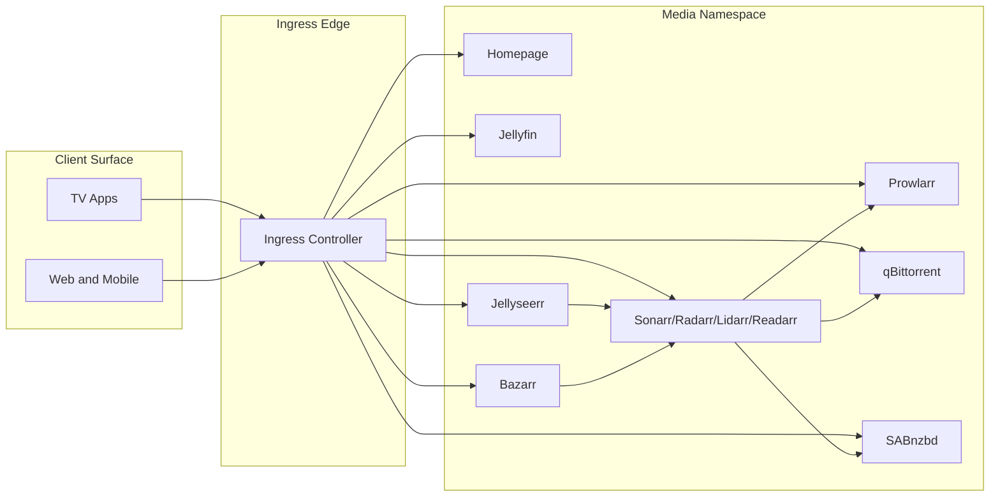
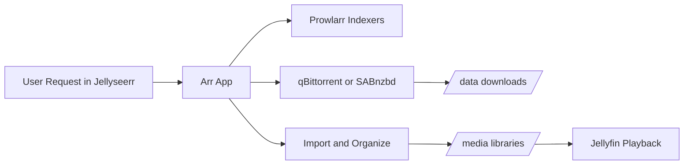
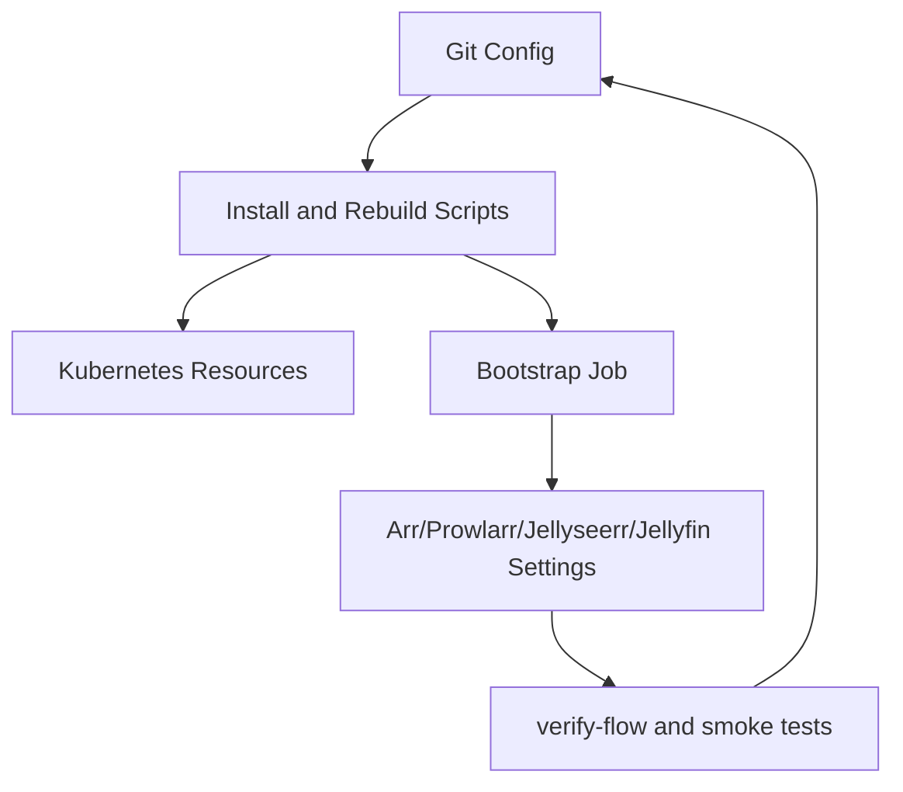

# Architecture

This platform is organized as a control plane plus a data plane.

- **Control plane**: deployment scripts, bootstrap job, reconcile logic, and verification tooling.
- **Data plane**: downloader clients, Arr import pipeline, media libraries, and playback services.

## Diagram Catalog

Rendered diagram artifacts live in `docs/diagrams`.

Core diagrams:
- `logical-topology.*`
- `media-data-pipeline.*`
- `bootstrap-sequence.*`

Product/operations diagrams:
- `deployment-model.*`
- `source-of-truth-flow.*`
- `operating-loop.*`
- `ui-surface-map.*`

Software design model diagrams:
- `software-component-model.*`
- `technology-adapter-model.*`
- `bootstrap-runtime-model.*`

Regenerate all diagrams:
```bash
bash scripts/render-architecture-diagrams.sh
```

## Logical Topology



## Request-to-Playback Data Path



## Control Path



## Software Design Models

Detailed model guide:
- [docs/software-design-models.md](software-design-models.md)

Key rendered artifacts:
- [Software component model](diagrams/software-component-model.svg)
- [Technology adapter model](diagrams/technology-adapter-model.svg)
- [Bootstrap runtime model](diagrams/bootstrap-runtime-model.svg)

## Architectural Guarantees

- Rerunning deployment and bootstrap is expected and supported.
- Downloader/import path conventions are explicit and codified.
- Namespace-scoped deployments allow side-by-side validation.
- Drift is reduced through periodic reconcile and explicit verification.
