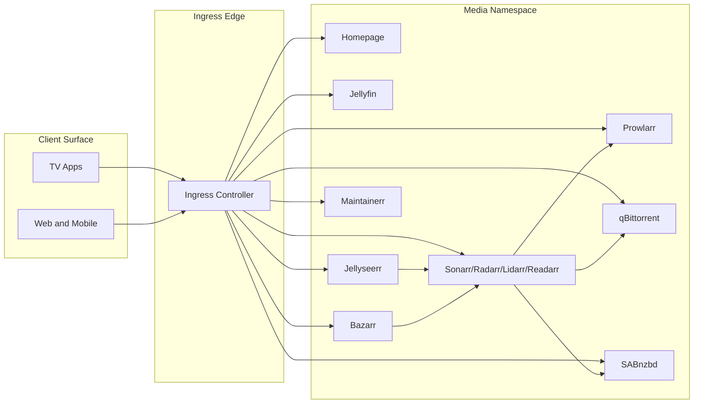
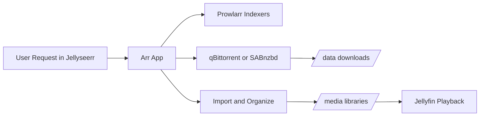
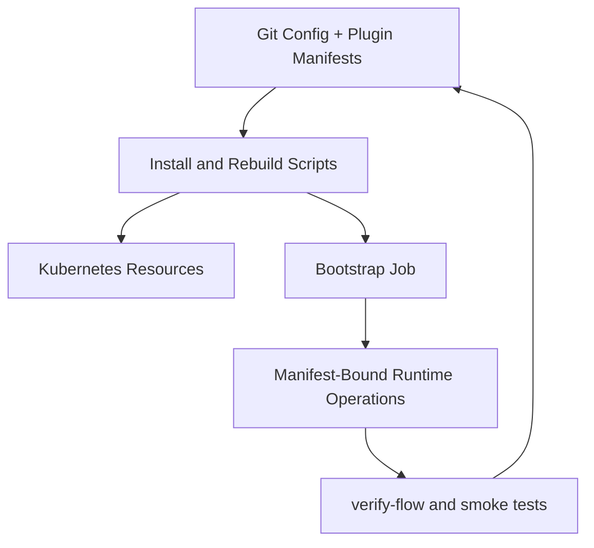

# Architecture

This platform is organized as a control plane plus a data plane.

- **Control plane**: deployment scripts, bootstrap job, reconcile logic, and verification tooling.
- **Data plane**: downloader clients, Arr import pipeline, media libraries, and playback services.

## Pluggable Layers and Contracts

The runtime is intentionally layered so technologies can be swapped locally without editing shared orchestration:

1. **Declarative bindings layer**
   `bootstrap/media-stack.bootstrap.json` selects active technologies per role through `technology_bindings`.
2. **Manifest registration layer**
   `scripts/bootstrap_defaults/plugins/<technology>/manifest.json` declares adapter classes, service classes, operation handlers, and aliases.
3. **App/technology implementation layer**
   `scripts/bootstrap_services/apps/<app>/`, `download_client_adapters/`, `media_server_adapters/`, and `servarr_technologies/`.
4. **Shared orchestration layer**
   `bootstrap-apps.py`, `runtime_factory/*`, and `bootstrap_runner_service.py` stay technology-neutral.

Contract rules:
- Registration is manifest-first, not runtime-config overrides.
- `adapter_hooks` is runtime-only for operation handlers, phase plans, wrapper phase-script maps, and scale-policy/worker orchestration lists.
- Shared operation contracts are generic (`torrent_client_login`, `setup_torrent_categories`).
- `BootstrapRunnerService` remains orchestration-only; app-specific branching belongs in app/adapter modules or declarative plans.

## Diagram Catalog

Rendered diagram artifacts live in `docs/diagrams`.

Core diagrams:
- `logical-topology.*`
- `network-protocol-topology.*`
- `media-data-pipeline.*`
- `bootstrap-sequence.*`

Product/operations diagrams:
- `deployment-model.*`
- `source-of-truth-flow.*`
- `operating-loop.*`
- `ui-surface-map.*`

Software design model diagrams:
- `software-component-model.*`
- `technology-adapter-model.*`
- `bootstrap-runtime-model.*`

Regenerate all diagrams:
```bash
bash scripts/render-architecture-diagrams.sh
```

## Logical Topology




## Network And Protocol Topology

- See [`docs/diagrams/network-protocol-topology.svg`](diagrams/network-protocol-topology.svg)
- Includes client-to-ingress routing, service/pod boundaries, protocol labels, and PVC data paths.


## Request-to-Playback Data Path



## Control Path



## Software Design Models

Detailed model guide:
- [docs/software-design-models.md](software-design-models.md)

Key rendered artifacts:
- [Software component model](diagrams/software-component-model.svg)
- [Technology adapter model](diagrams/technology-adapter-model.svg)
- [Bootstrap runtime model](diagrams/bootstrap-runtime-model.svg)


## Architectural Guarantees

- Rerunning deployment and bootstrap is expected and supported.
- Downloader/import path conventions are explicit and codified.
- Namespace-scoped deployments allow side-by-side validation.
- Drift is reduced through periodic reconcile and explicit verification.
- Technology replacement is role-local and binding-driven.
- Removing one technology manifest does not break unrelated technologies when that role is rebound.

---

**Project Steward**
Matthew Loschiavo • [matthewloschiavo.com](https://matthewloschiavo.com) • [mploschiavo@gmail.com](mailto:mploschiavo@gmail.com) • [LinkedIn](https://www.linkedin.com/in/matthewloschiavo)
