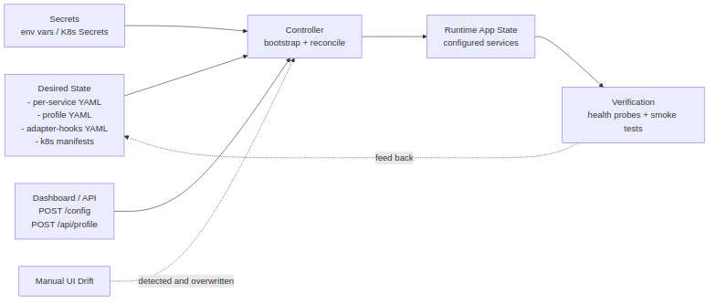
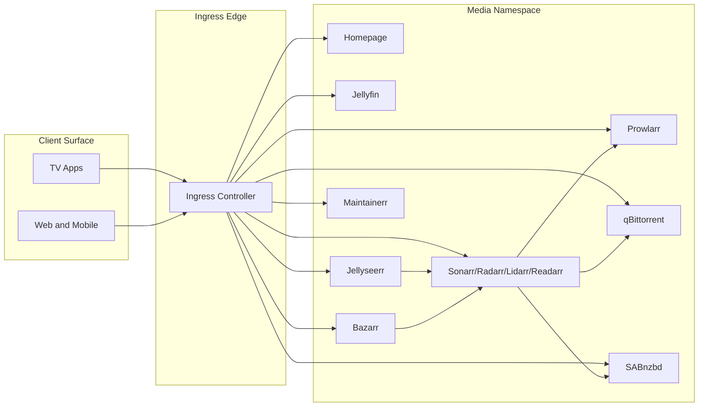
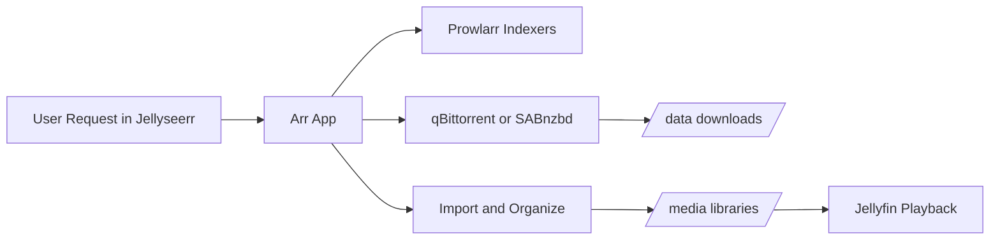
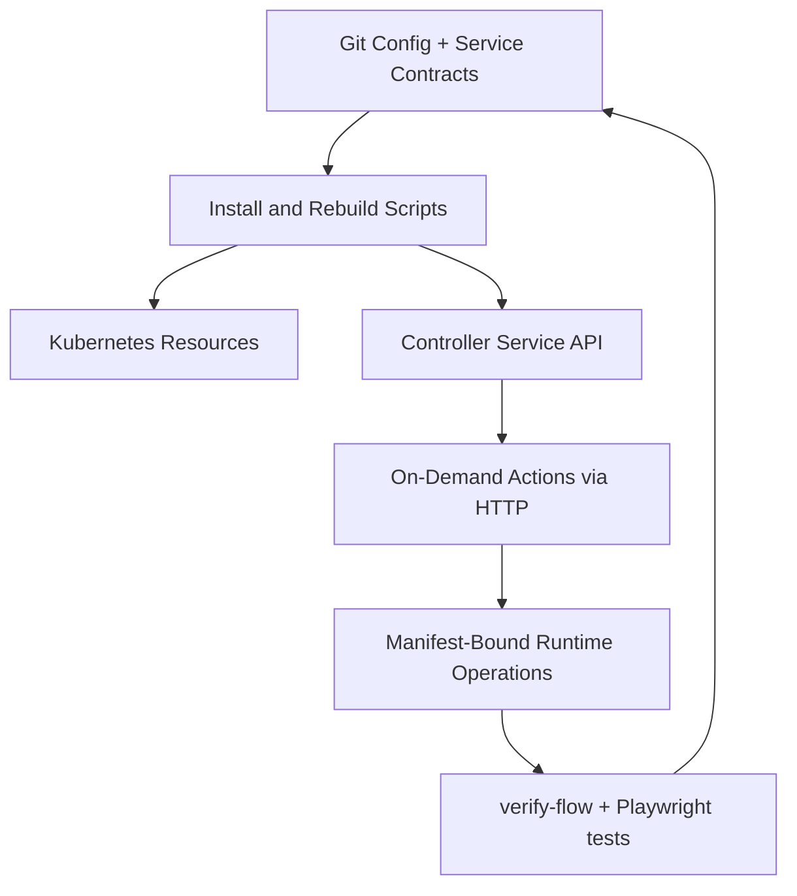

# Architecture

Media Stack is organized as a **control plane plus a data plane**.

- **Control plane** — deployment scripts, the persistent controller HTTP API service, reconcile logic, and verification tooling (promises registry, meta-ratchet, fresh-install verifier).
- **Data plane** — downloader clients, Arr import pipeline, media libraries, and playback services.

The rules below apply to both planes:

- Active component choice is declared only in `technology_bindings`.
- Technology registration is declared only in per-service YAML contracts.
- Runtime config can override behavior plans and handlers, but not class registration maps.
- Shared lifecycle events are concrete (`RunnerEvent`); handlers are technology-local (`event_handlers.<EVENT>.<handler_key>`), so base orchestration stays technology-neutral.

## Controller HTTP API service

The controller is a persistent Deployment (not a one-shot Job) exposing an HTTP API on port 9100. It serves as the operational control surface for both Kubernetes and Docker Compose.

### Key endpoints

| Endpoint | Purpose |
|---|---|
| `POST /actions/{name}` | Trigger actions: `bootstrap`, `auto-indexers`, `restart-apps`, `sync-indexers`, `envoy-config`, `reconcile` |
| `GET /status` | Full state with phases, preflights, app status, action history |
| `GET /config` / `POST /config` | Runtime toggles (e.g. `auto_download_content`) |
| `GET /logs/stream` | Server-Sent Events (SSE) real-time log stream |
| `POST /webhooks` | Register webhook URLs for action completion/error notifications |
| `POST /reload` | Hot-reload bootstrap profile YAML |
| `GET /healthz` / `GET /readyz` | Kubernetes liveness/readiness probes |
| `GET /` | Interactive HTML dashboard |

### Features

- **Action-level retry** with exponential backoff (`{"retry": 2}` in POST body or `BOOTSTRAP_ACTION_MAX_RETRIES` env).
- **Parallel phase execution** — phases with `"parallel": true` in config run steps concurrently.
- **Parallel download client preparation** — qBittorrent and SABnzbd configure concurrently.
- **Parallel auto-indexer testing** — configurable via `AUTO_INDEXER_PARALLEL_WORKERS` (default 4).
- **Webhook notifications** on action complete/error.
- **Runtime config toggles** persist across actions and merge into every action as defaults.

## Plugin isolation

The platform enforces strict isolation between platform code and service-specific code. A third-party developer can implement any service by editing only two locations:

1. `contracts/services/{service}.yaml` — service metadata, API key format, health path, etc.
2. `src/media_stack/services/apps/{service}/` — all implementation code.

**Zero platform code changes are required.** The `services/apps/` directory is designed to be extractable into a separate git repo.

`tests/unit/test_no_hardcoded_services.py` scans all platform Python files for hardcoded service names. **Current state: 0 allowlist entries.** Any new violation fails CI.

### Layered design

1. **Service registry layer** — `contracts/services/*.yaml`. Per-service YAML contracts declare metadata, API key format, health endpoints, version paths. The registry loads at import time.
2. **YAML defaults layer** — `contracts/defaults/*.yaml`. Operational defaults (Arr settings, download client config, disk guardrails).
3. **App / technology implementation layer** — `src/media_stack/services/apps/{app}/`. All service-specific code: adapters, config resolvers, runtime ops, preflight handlers, CLI tools.
4. **Shared orchestration layer** — `cli/commands/`, `services/runtime_factory/`, `api/`. Technology-neutral orchestration, routing, and API handlers.

### Contract rules

- Registration is YAML-contract-first — the service registry is the single source of truth.
- `adapter_hooks` in profile YAML is runtime-only for phase plans, scale-policy, and operation handlers.
- Shared operation contracts are generic (`torrent_client_login`, `setup_torrent_categories`).
- Platform code uses registry lookups by category (e.g. `category="torrent"`), not by service name.

## Design principles

The component, adapter, and bootstrap-runtime models are illustrated in [the diagram catalog below](#diagrams). The principles those diagrams encode:

- **Composition over inheritance** for orchestration and side-effect boundaries.
- **Per-technology adapters** for swap isolation.
- **Manifest-first registration contracts** for adapters / services / operations.
- **Typed config and explicit operation plans** as runtime contracts.
- **Generic shared operation names** to avoid technology-specific branding in base orchestration.
- **Thin shell entrypoints + Python implementations** under `src/media_stack/cli/commands/` and `src/media_stack/services/`.

## Source-of-truth hierarchy

The platform follows a strict desired-state hierarchy. 

### Canonical sources

1. **Git-tracked manifests and configs**
   - `k8s/*.yaml`, `k8s/profiles/*`
   - `docker/docker-compose.yml`, `docker/.env.example`
   - `contracts/defaults/*.yaml`, `contracts/services/*.yaml`
   - `contracts/media-stack.profile.yaml`, `contracts/media-stack.profile.schema.json`
   - `.ratchets/promises/promises.yaml` — post-install promises registry
   - `src/media_stack/contracts/runner_operation_plans.json`
   - `src/media_stack/contracts/media_server_operation_plans.json`
   - scripts under `bin/`

2. **Cluster secrets generated/reconciled from code**
   - `media-stack-secrets` (Kubernetes Secret)
   - local export file `secrets.generated.env` for operator visibility

3. **Runtime state in each application** — Arr / Prowlarr / Jellyseerr / Jellyfin UI state.

Runtime state is not authoritative if it conflicts with declarative config.

### Reconciliation rules

- Install/rebuild scripts always re-apply profile manifests.
- The bootstrap re-applies manifest-bound cross-app integration state.
- The promises registry probes verify the desired state actually held.
- Optional periodic reconcile job reduces drift over time.

### Drift policy

| State | Status |
|---|---|
| Temporary runtime changes while testing | Allowed |
| Runtime changes promoted back into config | Expected |
| Runtime changes overwritten by next reconcile | Expected |
| Undocumented manual UI changes that don't survive rebuild | Not allowed |

### Promotion workflow

1. Make declarative change in Git.
2. Validate in non-prod namespace.
3. Promote the same change to primary namespace.
4. Run verification scripts (`bin/verify-fresh-install.sh`, `bin/verify-stack.sh`).

See [GitOps](gitops.md) for the long-form workflow.

## Diagrams

Rendered diagram artifacts live in `docs/diagrams/`. Regenerate all of them:

```bash
bash bin/render-architecture-diagrams.sh
```

### Core diagrams

- `logical-topology.*`
- `network-protocol-topology.*`
- `media-data-pipeline.*`
- `bootstrap-sequence.*`

### Product / operations diagrams

- `deployment-model.*`
- `source-of-truth-flow.*`
- `operating-loop.*`
- `ui-surface-map.*`

### Software design model diagrams

- `software-component-model.*` — composition root vs. runtime services vs. adapter modules. Where to add code for a new technology without touching global orchestration.
- `technology-adapter-model.*` — how `technology_bindings` + plugin manifests drive runtime resolution. Registration contracts for adapters, app services, and operation handlers. Separates manifest registration from runtime-only `adapter_hooks` overrides.
- `bootstrap-runtime-model.*` — lifecycle states of bootstrap execution. Failure and retry behavior made explicit for troubleshooting and test design.

## Logical topology




## Network and protocol topology

See [`docs/diagrams/network-protocol-topology.svg`](../diagrams/network-protocol-topology.svg). Includes client-to-ingress routing, service/pod boundaries, protocol labels, and PVC data paths.


## Request-to-playback data path



## Control path



## Architectural guarantees

- Rerunning deployment and bootstrap is expected and supported (idempotent).
- Downloader / import path conventions are explicit and codified.
- Namespace-scoped deployments allow side-by-side validation.
- Drift is reduced through periodic reconcile and explicit verification.
- Technology replacement is role-local and binding-driven.
- Removing one technology manifest does not break unrelated technologies when that role is rebound.
- Promises in `.ratchets/promises/promises.yaml` survive `compose down -v` because the meta-ratchet enforces every promise traces back to a real handler.

---

**Project Steward**
Matthew Loschiavo • [matthewloschiavo.com](https://matthewloschiavo.com) • [mploschiavo@gmail.com](mailto:mploschiavo@gmail.com) • [LinkedIn](https://www.linkedin.com/in/matthewloschiavo)
