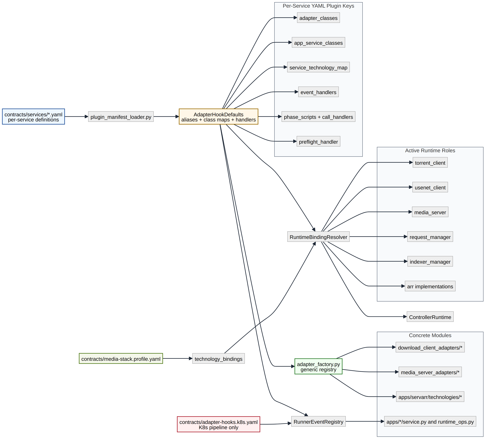

# Technology Swaps (Manifest-First, Config-Driven)

This stack supports technology replacement without editing the bootstrap entrypoint.

Design model reference:
- [Technology adapter model diagram](../diagrams/technology-adapter-model.svg)



## Source of Truth for Swaps

Swaps are controlled by:

1. `technology_bindings` in `contracts/media-stack.profile.yaml`
2. Per-service YAML in `contracts/services/<technology>.yaml` (plugin section)
3. Per-technology adapter/service modules under `src/media_stack/services/...`

## Manifest Contract Surface

Per-technology manifests support these keys:
- `technology`
- `aliases`
- `adapter_classes`
- `before_common_steps`
- `app_service_classes`
- `service_technology_map`
- `event_handlers`
- `operation_handlers` (legacy compatibility only)
- `capability_defaults`

Role-specific class contracts:
- `adapter_classes.servarr`
- `adapter_classes.download_client`
- `adapter_classes.media_server`

Shared runtime lifecycle contracts are concrete and technology-neutral:
- `INIT`
- `VALIDATE`
- `PLAN`
- `ACQUIRE`
- `RUN`
- `POST`
- `ENSURE`
- `CHECK_STATUS`
- `REPORT`
- `CANCEL`
- `RETRY`
- `RECOVER`
- `RELEASE`
- `CLEANUP`
- `FINALIZE`
- `SHUTDOWN`

`adapter_hooks` is no longer used for adapter/service registration overrides.  
Registration is manifest-only. Runtime-only hooks still supported:
- `adapter_hooks.event_handlers`
- `adapter_hooks.operation_handlers`
- `adapter_hooks.runner_event_plans`
- `adapter_hooks.runner_operation_plans`
- `adapter_hooks.media_server_event_plans`
- `adapter_hooks.media_server_operation_plans`
- `adapter_hooks.runner_phase_scripts`
- `adapter_hooks.bootstrap_all`
- `adapter_hooks.bootstrap_job`
- `adapter_hooks.scale_policy`

Disallowed runtime registration overrides:
- `adapter_hooks.adapter_classes`
- `adapter_hooks.download_client_adapter_classes`
- `adapter_hooks.media_server_adapter_classes`
- `adapter_hooks.app_service_classes`
- `adapter_hooks.service_technology_map`

## Active Bindings

`technology_bindings` currently supports:
- `torrent_client`
- `usenet_client`
- `media_server`
- `request_manager`

Binding requirement:
- `media_server` is required.
- `torrent_client` and `usenet_client` are optional (phase plans + runtime config decide whether related flows run).

Example:

```json
{
  "technology_bindings": {
    "torrent_client": "qbittorrent",
    "usenet_client": "nzbget",
    "media_server": "plex",
    "request_manager": "openseerr"
  }
}
```

## Built-In Swap Families

Media server adapters:
- `jellyfin`
- `emby`
- `plex`
- `mythtv`

Request manager adapters:
- `jellyseerr`
- `openseerr` (alias: `openseer`)

Download client adapters:
- Torrent: `qbittorrent`, `transmission`
- Usenet: `sabnzbd`, `nzbget`, `jdownloader`, `grabit`

Servarr app adapters:
- `sonarr`, `radarr`, `lidarr`, `readarr` (plus capability-driven behavior)

Dashboard app operations:
- `homepage`

## App Boundary Layout (No Shared App Logic)

App-specific logic should live under one app package.  
For Jellyfin, the implementation boundary is now:

- `src/media_stack/services/apps/jellyfin/runtime_ops.py`
- `src/media_stack/services/apps/jellyfin/livetv_service.py`
- `src/media_stack/services/apps/jellyfin/livetv_source_service.py`
- `src/media_stack/services/apps/jellyfin/livetv_state_service.py`
- `src/media_stack/services/apps/jellyfin/libraries_service.py`
- `src/media_stack/services/apps/jellyfin/home_rails_service.py`
- `src/media_stack/services/apps/jellyfin/playback_service.py`
- `src/media_stack/services/apps/jellyfin/plugins_service.py`
- `src/media_stack/services/apps/jellyfin/prewarm_service.py`
- `src/media_stack/services/apps/jellyfin/config_models.py`

Root-level `src/media_stack/services/jellyfin_*` modules are retired.
Bootstrap handler wiring now calls Jellyfin operations from this app-local boundary directly.

## Swap Process

1. Add/update runtime config blocks (`download_clients`, app config, etc.).
2. Add or update one technology manifest.
3. Set the active key in `technology_bindings`.
4. Validate config:

```bash
bash bin/utils/validate-bootstrap-config.sh
```

5. Verify manifest contracts and swap matrix:

```bash
python3 -m unittest tests.unit.test_technology_pluggability_contracts
python3 -m unittest tests.unit.test_technology_swap_matrix_e2e
```

6. Reconcile:

```bash
# Cross-platform via the controller HTTP API:
curl -X POST http://localhost:9100/actions/bootstrap

# Linux convenience (shell script):
bash bin/bootstrap-all.sh
```

## Declarative Wrapper Phases

Bootstrap wrapper flow is config-first:

- `adapter_hooks.bootstrap_all.phase_plan`: controls order and conditions for `bootstrap-all`.
- `adapter_hooks.bootstrap_all.phase_plan[*].operation`: use `run`.
- `adapter_hooks.bootstrap_all.phase_plan[*].params.action`: dispatch action (`component_script`, `script`, `enable_components`).
- `adapter_hooks.bootstrap_job.phase_plan`: controls order and conditions for `run-bootstrap-job`.
- `adapter_hooks.bootstrap_job.config_resolver.operations`: declares ordered config-resolver operations.
- Resolver operation handlers come from plugin manifests (`config_resolver_handlers`) with optional config overrides at `adapter_hooks.bootstrap_job.config_resolver.handler_specs`.
- `phase_plan[*].when`: declarative condition object (`all_of`, `any_of`, `not`, `var`, `equals`, `in`, `truthy`, `exists`).
- `phase_plan[*].skip_flag`: generates CLI flags (for example `skip_torrent_client_ensure` => `--skip-torrent-client-ensure`).

Skip flags are auto-generated from phase plan keys (e.g., `skip_torrent_client_ensure` => `--skip-torrent-client-ensure`).

### Example: Jellyfin -> Plex

1. Set binding:

```json
{
  "technology_bindings": {
    "media_server": "plex"
  }
}
```

2. Keep `contracts/services/plex.yaml` present.
3. Add/update `adapter_hooks.media_server_event_plans.plex` (or legacy `media_server_operation_plans`) only if you want Plex-specific runtime operations.
4. Reconcile; Jellyfin-specific operations are not executed when `media_server=plex`.

## Prove Isolation and Removability

To test that one technology is truly self-contained:

1. Rebind the role to an alternative technology.
2. Reconcile once.
3. Temporarily remove the original technology manifest (or remove only its role keys).
4. Run contract and bootstrap tests:

```bash
python3 -m unittest tests.unit.test_technology_pluggability_contracts
python3 -m unittest tests.unit.test_bootstrap_services_runtime_factory
python3 -m unittest tests.unit.test_bootstrap_services_bootstrap_runner
```

Expected result:
- Unrelated technologies continue to load and run.
- Missing removed technology fails only when actively invoked.

## Add a New Technology

1. Create per-service YAML contract:
   - `contracts/services/<your-tech>.yaml`
2. Add adapter/service module:
   - download client: `src/media_stack/services/download_client_adapters/<your-tech>.py`
   - media server: `src/media_stack/services/media_server_adapters/<your-tech>.py`
   - request manager app: `src/media_stack/services/apps/<your-tech>/service.py`
3. Ensure manifest points to your class path (`module:ClassName`).
4. Add config block and switch binding key.
5. Validate + run bootstrap.

If you need custom behavior hooks, add only event hooks/plans in `adapter_hooks` (not class registration).

## Compatibility Notes

- Non-Jellyfin media servers currently run through plan-driven adapters.  
  If a backend has no operation plan, media-server phases are skipped with warnings instead of hard-failing.
- Request manager defaults to `jellyseerr` when `technology_bindings.request_manager` is omitted.
- Legacy flat operation maps remain supported for compatibility, but new manifests should register under `event_handlers`.

---

**Project Steward**  
Matthew Loschiavo • [matthewloschiavo.com](https://matthewloschiavo.com) • [mploschiavo@gmail.com](mailto:mploschiavo@gmail.com) • [LinkedIn](https://www.linkedin.com/in/matthewloschiavo)
