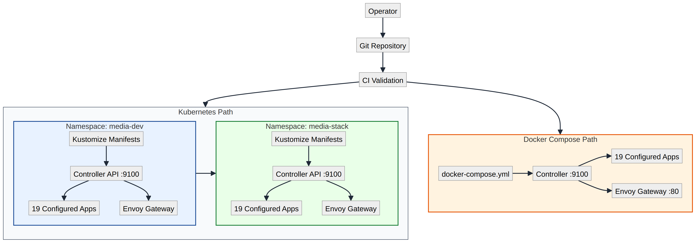

# Deployment Model

## Core Model

The stack supports two runtime targets:
- Kubernetes namespace deployment (primary path)
- Docker Compose project deployment (alternate path)



Kubernetes flow:
1. Apply profile manifests.
2. Generate or reconcile secrets.
3. Wait for workloads.
4. Run bootstrap job for cross-app wiring.
5. Verify ingress and service integration.
6. Keep drift low with periodic reconcile.

Compose flow:
1. Render native compose spec (`docker/docker-compose.yml` + env expansion).
2. Recreate/update selected service containers via Docker SDK.
3. Apply edge routing/auth labels from bootstrap profile/runtime config.
4. Wait for running/healthy containers.
5. Run compose smoke/status checks.

Bootstrap deployment profile:
- `bootstrap/media-stack.bootstrap.yaml` declares target, purpose, stack name, install toggles, exposure intent, route strategy, and auth provider defaults.
- Use `bash scripts/validate-bootstrap-profile.sh` to validate profile shape + semantics.

## Profiles

- `minimal`: essential media request/playback path.
- `full`: core + optional components + reconcile helpers.
- `public-demo`: demo-safe defaults and reduced downloader automation.
- `power-user`: full with additional operational guardrails.

Profile manifests live in `k8s/profiles/*` (Kubernetes target).

## Storage Modes

- `dynamic-pvc` (required): StorageClass/PVC-driven and portable across clusters.

Example:
```bash
bash scripts/install.sh --profile full --storage-mode dynamic-pvc --node-ip <NODE_IP>
```

## Namespace Strategy

Use namespace isolation for environment promotion and safe experimentation.

Example:
```bash
bash scripts/install.sh --profile full --namespace media-stack-dev --ingress-domain dev.local --node-ip <NODE_IP>
bash scripts/install.sh --profile full --namespace media-stack-prod --ingress-domain prod.local --node-ip <NODE_IP>
```

## Rebuild-First Operations

The expected operating posture is rebuild-ready:
- PVC manifests are applied idempotently
- manifests are re-applied safely
- bootstrap wiring is re-runnable
- verification scripts validate outcomes

One command for full Kubernetes rebuild + verify:
```bash
bash scripts/deploy-verify.sh <NODE_IP> [NAMESPACE] [PROFILE]
```

Compose rebuild example:
```bash
bash scripts/deploy-stack.sh \
  --platform-target compose \
  --namespace media-dev \
  --compose-project-name media-dev
```

Compose rebuild with profile auto-defaults:
```bash
bash scripts/deploy-stack.sh --bootstrap-profile-file bootstrap/media-stack.bootstrap.yaml
```

## Runtime Reconciliation

- Kubernetes target:
  - Bootstrap job config is supplied via ConfigMap from `bootstrap/media-stack.bootstrap.json`.
  - Optional reconcile CronJob can periodically re-apply desired application wiring.
  - Drift introduced in web UIs is intentionally overwritten by declarative configuration.
- Compose target:
  - Runtime deploy/rebuild is compose-spec + Docker SDK driven.
  - Route strategy supports subdomain, path-prefix, or hybrid patterns through adapter-managed labels.
  - Auth provider wiring stubs support `authelia` / `authentik` middleware references.
  - Jellyfin direct-host routing remains available for native TV/mobile clients.
  - Kubernetes bootstrap job/CronJob reconciliation is not used.

## Multi-Node / Remote Operator Note

Kubernetes mode is StorageClass/PVC-driven, so remote operators can apply manifests from any machine with cluster access.

---

**Project Steward**
Matthew Loschiavo • [matthewloschiavo.com](https://matthewloschiavo.com) • [mploschiavo@gmail.com](mailto:mploschiavo@gmail.com) • [LinkedIn](https://www.linkedin.com/in/matthewloschiavo)
