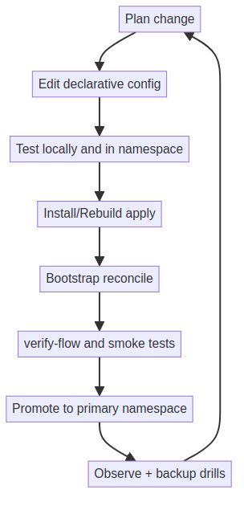
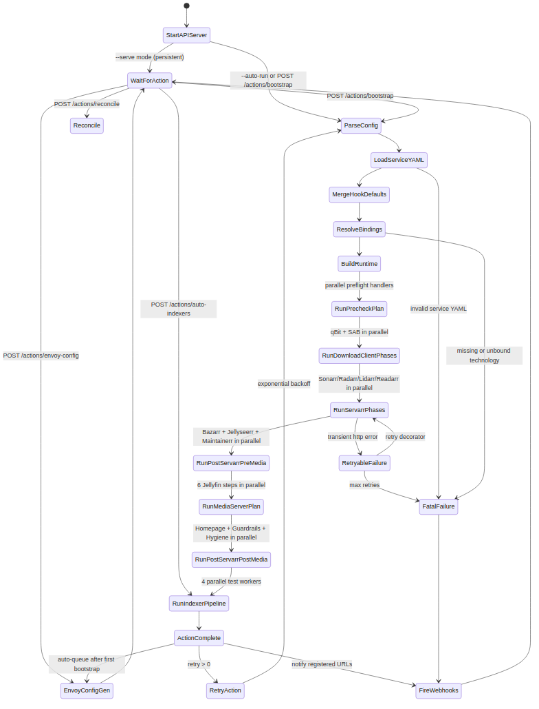

# Operations Runbook



> **Cross-platform note.** Every workflow CLI below works identically on
> Windows, macOS, and Linux — they're Python modules, not shell scripts.
> The `bash bin/<subdir>/*.sh` forms shown alongside are Linux convenience
> wrappers (6-line `exec` shims). Where a script is genuinely Linux-only
> (POSIX shell tricks, `/etc/hosts` rendering, MicroK8s integration) the
> section calls it out explicitly.

## Day 0: Install

Cross-platform:
```bash
.venv/bin/python -m media_stack.cli.commands.install_main --profile full --node-ip <NODE_IP>
.venv/bin/python -m media_stack.cli.commands.install_main --profile full --storage-mode dynamic-pvc --node-ip <NODE_IP>
```

Namespace-isolated environment:
```bash
.venv/bin/python -m media_stack.cli.commands.install_main \
    --profile full --namespace media-stack-dev --ingress-domain dev.local --node-ip <NODE_IP>
.venv/bin/python -m media_stack.cli.commands.install_main \
    --profile full --namespace media-stack-dev --storage-mode dynamic-pvc --ingress-domain dev.local --node-ip <NODE_IP>
```

Linux convenience: `bash bin/install/install.sh ...`.

## Day 0/1: Rebuild Drill

Use this regularly to prove recoverability:
```bash
.venv/bin/python -m media_stack.cli.commands.deploy_verify_main <NODE_IP> [NAMESPACE] [PROFILE]
```

Linux convenience: `bash bin/test/deploy-verify.sh ...`.

## Secrets Lifecycle

Cross-platform (Windows / macOS / Linux):
```bash
.venv/bin/python -m media_stack.cli.commands.generate_secrets_main
ROTATE_EXISTING=1 .venv/bin/python -m media_stack.cli.commands.generate_secrets_main
```

Linux convenience: `bash bin/utils/generate-secrets.sh`.

Credential reconcile helpers (Linux-only debug scripts under `bin/debug/`):
```bash
bash bin/debug/ensure-qbit-credentials.sh
bash bin/debug/set-qbit-secret.sh <USERNAME> <PASSWORD>
```

## Bootstrap and Reconcile

The controller is a persistent HTTP API service on both platforms.

### Bootstrap API (port 9100)

Trigger actions via HTTP:
```bash
# Full bootstrap pipeline
curl -X POST http://localhost:9100/actions/bootstrap

# With runtime overrides
curl -X POST http://localhost:9100/actions/bootstrap \
  -H "Content-Type: application/json" \
  -d '{"auto_download_content": true, "retry": 2}'

# Individual actions
curl -X POST http://localhost:9100/actions/auto-indexers
curl -X POST http://localhost:9100/actions/envoy-config
curl -X POST http://localhost:9100/actions/restart-apps
curl -X POST http://localhost:9100/actions/sync-indexers
curl -X POST http://localhost:9100/actions/reconcile

# Runtime config toggles (persist across actions)
curl -X POST http://localhost:9100/config \
  -H "Content-Type: application/json" \
  -d '{"auto_download_content": true}'

# Hot-reload profile YAML
curl -X POST http://localhost:9100/reload

# Check status
curl http://localhost:9100/status

# Stream logs (SSE)
curl http://localhost:9100/logs/stream

# Register webhook
curl -X POST http://localhost:9100/webhooks \
  -H "Content-Type: application/json" \
  -d '{"url": "http://example.com/hook"}'

# Interactive dashboard
open http://localhost:9100/
```

### Script-based bootstrap (alternative)

The bootstrap-all entry point is currently only available as a Linux shell wrapper:

```bash
bash bin/bootstrap-all.sh
bash bin/run-bootstrap-job.sh
bash bin/test/verify-flow.sh [NAMESPACE]
```

On Windows / macOS, use the HTTP-API form (above) instead — `curl -X POST http://localhost:9100/actions/bootstrap` runs the same pipeline.



Checkpoint/resume controls (Linux only — bootstrap-all.sh is still a shell script):
```bash
# default resume enabled
bash bin/bootstrap-all.sh

# disable resume and force full phase rerun
bash bin/bootstrap-all.sh --no-resume

# custom checkpoint state file
bash bin/bootstrap-all.sh --state-file .state/bootstrap-all-media-stack.json
```

Runtime overlays:
- base + env overlays live under `config/runtime/`.
- enable with `config_overlays.enabled=true` in your profile YAML.
- select env with `config_overlays.env` (`dev`, `stage`, `prod`).

Optional periodic reconcile is available through Kubernetes CronJob manifests.
Default scheduled jobs in `full` profile:
- `media-stack-controller-reconcile`: full idempotent reconcile loop
- `media-stack-jellyfin-prewarm`: metadata/artwork + guide/channel prewarm refresh
- `media-stack-media-hygiene`: failed queue cleanup + filesystem hygiene pass + qB IP filter reconcile

qB IP filter defaults are config-as-code under `media_hygiene.qbit_ipfilter` in
`contracts/defaults/operations.yaml`:
- Source URL: `https://github.com/DavidMoore/ipfilter/releases/download/lists/ipfilter.dat`
- Refresh cadence: minimum once per 24h (even though hygiene job runs more often)
- Storage targets: primary PVC path plus host-path mirror for mixed storage-mode compatibility
- Failure behavior: if source is unavailable, keep and re-apply cached filter file instead of failing

Disk guardrails defaults are configured in `contracts/defaults/operations.yaml` under `disk_guardrails` (default max 65% used, target 58%, qB cleanup policy when over threshold, monitor path `/srv-stack/media`).
Maintainerr is deployed as an optional app (`maintainerr.<domain>`) with persistent config at `/opt/data`.
Maintainerr policy-as-code is also rendered to `/srv-config/maintainerr/policy.json` from the `contracts/services/maintainerr.yaml` defaults section.
Rule definitions are managed as one-file-per-rule JSON/YAML under `src/media_stack/contracts/maintainerr_rules/{json,yaml}/`
with optional namespace-local overrides from `maintainerr.rules_library.relative_path`.

qB queue and category-budget guardrails are configured under
`download_clients.qbittorrent.queue_guardrails`:
- `max_queued_by_category`: hard cap on queued/downloading items per category
- `max_total_size_gib_by_category`: optional size cap per category (GiB)
- `max_weight_percent_by_category`: optional weighted-share cap per category (% of managed qB payload)
- `budget_prune_states`: which torrent states are eligible when reducing category budget

## Validation and Tests

Cross-platform (Python module CLIs):
```bash
.venv/bin/python -m media_stack.cli.commands.run_unit_tests_main
RUN_PLAYWRIGHT=1 STACK_NODE_IP=<NODE_IP> .venv/bin/python -m media_stack.cli.commands.run_unit_tests_main
RUN_API_E2E=1 NAMESPACE=<NAMESPACE> .venv/bin/python -m media_stack.cli.commands.run_unit_tests_main
.venv/bin/python -m media_stack.cli.commands.microk8s_smoke_test_main <NODE_IP> [NAMESPACE]
.venv/bin/python -m media_stack.cli.commands.validate_controller_config_main
.venv/bin/python -m media_stack.cli.commands.run_playwright_screenshots_main <NODE_IP> [NAMESPACE]
```

Linux convenience wrappers: `bash bin/test/{test,run-api-e2e,microk8s-smoke-test,run-playwright-screenshots}.sh`, `bash bin/utils/validate-bootstrap-config.sh`, `bash bin/debug/capture-k8s-snapshots.sh`.

## Backup and Restore

Cross-platform:
```bash
.venv/bin/python -m media_stack.cli.commands.backup_stack_main
.venv/bin/python -m media_stack.cli.commands.restore_stack_main ./backups/media-stack-backup-YYYYMMDD-HHMMSS.tar.gz
```

Linux convenience: `bash bin/utils/{backup-stack,restore-stack}.sh`.

## Observability

`bash bin/utils/stack-status.sh` and `bash bin/test/watch-install.sh` are Linux
convenience wrappers (the underlying `watch_install_main` Python module is
cross-platform; the stack-status helper is a small shell script that wraps
`docker ps` + `kubectl get pods` for terminal-friendly output).

```bash
# Cross-platform watch-install:
.venv/bin/python -m media_stack.cli.commands.watch_install_main

# DEBUG bootstrap rerun (Linux-only — bootstrap-all.sh is shell-based;
# Windows / macOS: re-trigger via curl -X POST .../actions/bootstrap
# after temporarily setting MEDIA_STACK_LOG_LEVEL=DEBUG on the controller pod):
MEDIA_STACK_LOG_LEVEL=DEBUG bash bin/bootstrap-all.sh --no-resume
```

## Namespace Hygiene

Clean up stale test namespaces:
```bash
kubectl get ns -o name | grep '^namespace/media-stack-' | grep -v '^namespace/media-stack$' | xargs -r kubectl delete --wait=false
```

## Related Docs

- [architecture/overview.md](../architecture/overview.md)
- [deployment.md](deployment.md)
- [networking.md](networking.md)
- [storage.md](storage.md)
- [reference/maintainerr-rules.md](../reference/maintainerr-rules.md)
- [troubleshooting.md](troubleshooting.md)

---

**Project Steward**
Matthew Loschiavo • [matthewloschiavo.com](https://matthewloschiavo.com) • [mploschiavo@gmail.com](mailto:mploschiavo@gmail.com) • [LinkedIn](https://www.linkedin.com/in/matthewloschiavo)
