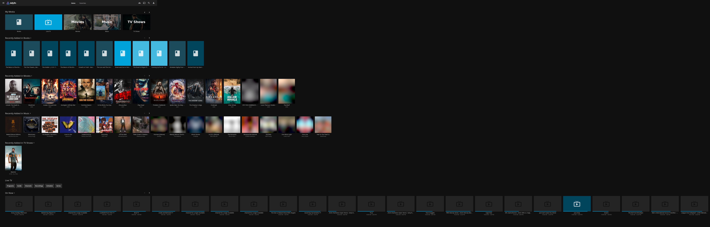
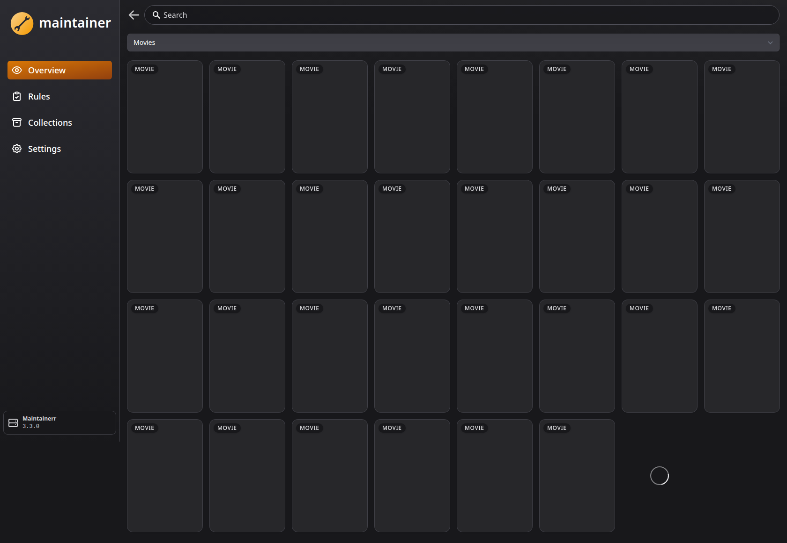
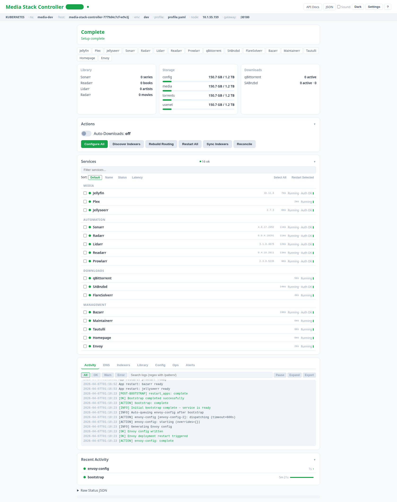

# Screenshots and Runtime Evidence

This directory stores reproducible runtime artifacts captured from a live namespace.

> **Freshness** — the PNGs currently checked in predate the home-screen
> redesign, user-management UI, TLS enablement, and admin-bootstrap
> rotation flow. Recapture against a fresh deploy before using these
> as marketing/docs material. Use `bin/run-playwright-screenshots.sh`
> below; it logs in first so shots reflect authenticated dashboards.

## Folder Structure

- `docs/screenshots/apps/`
  - Playwright-captured UI screenshots for ingress-exposed apps.
  - See `docs/screenshots/apps/README.md`.
- `docs/screenshots/cluster/`
  - Timestamped terminal snapshots (`kubectl` outputs for pods/services/ingress/PVC/events).
  - See `docs/screenshots/cluster/README.md`.

## Capture UI Screenshots

```bash
bash bin/run-playwright-screenshots.sh <NODE_IP> [NAMESPACE] [OUT_DIR]
```

Example:

```bash
bash bin/run-playwright-screenshots.sh 192.168.1.60 media-stack
```

This runs `tests/e2e/playwright/tests/screenshot-capture.spec.ts` and writes one PNG per app host.
The capture flow now attempts app login first (using credentials from env/Kubernetes secret),
so screenshots reflect authenticated dashboards rather than pre-login shells.

Sample authenticated captures:







## Capture Kubernetes Terminal Snapshots

```bash
bash bin/capture-k8s-snapshots.sh [NAMESPACE] [OUT_DIR]
```

Example:

```bash
bash bin/capture-k8s-snapshots.sh media-stack
```

This writes timestamped `.txt` evidence files for:
- namespaces, nodes
- pods, services, ingress, PVCs, deployments, jobs
- namespace events
- ingress describe output

## Controller Dashboard

The controller dashboard (port 9100) provides a full operational view of the stack:



Features include service health probes, API authentication validation, download queues,
library stats, disk usage, live SSE logs, DNS access matrix, indexer management,
Prometheus metrics, and 40+ API endpoints.

## Recommended Baseline Set

- controller dashboard
- homepage
- jellyfin
- jellyseerr
- sonarr/radarr
- qbittorrent/sabnzbd
- maintainerr
- one full cluster snapshot batch

For architecture visuals, see `docs/diagrams/`.

---

**Project Steward**
Matthew Loschiavo • [matthewloschiavo.com](https://matthewloschiavo.com) • [mploschiavo@gmail.com](mailto:mploschiavo@gmail.com) • [LinkedIn](https://www.linkedin.com/in/matthewloschiavo)
