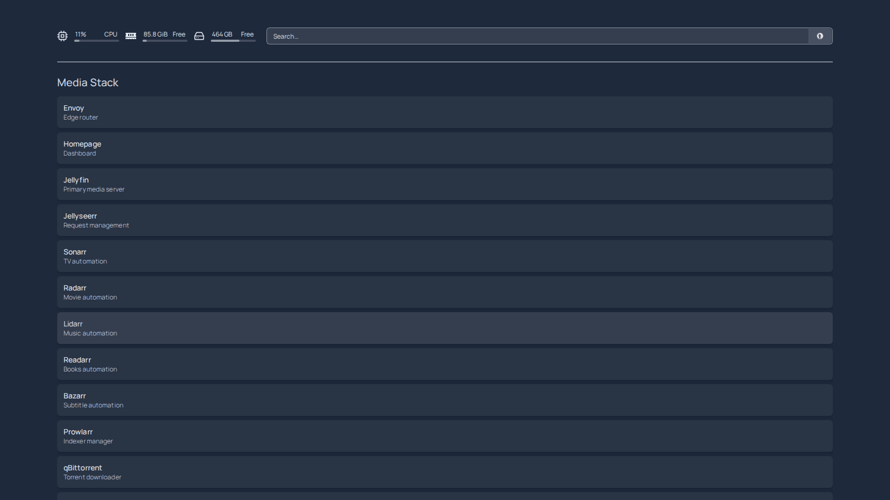
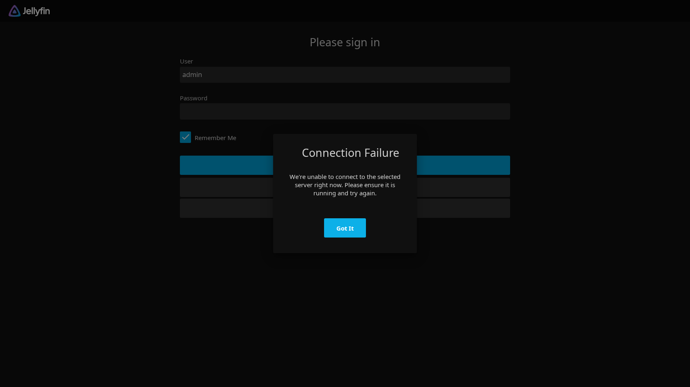
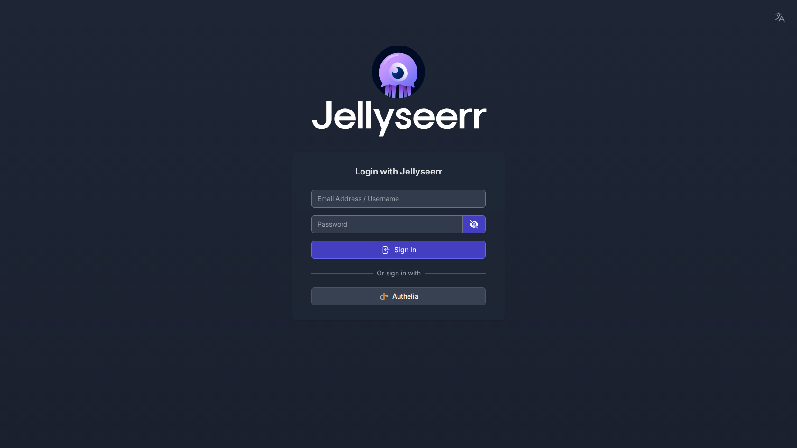
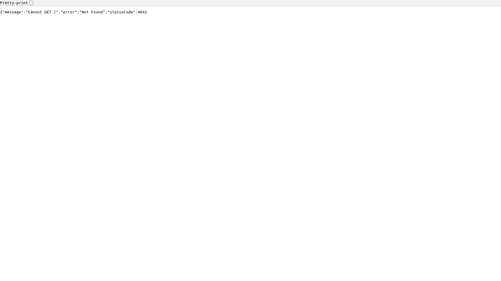

# Screenshots and Runtime Evidence

This directory stores reproducible runtime artifacts captured from a live namespace.

> **Freshness** — captures are refreshed against each release. Re-run
> the capture tool below before using PNGs as marketing/docs material;
> it logs in through Authelia first so shots reflect authenticated
> dashboards.

## Folder Structure

- `docs/screenshots/apps/`
  - Playwright-captured UI screenshots for ingress-exposed apps.
  - See `docs/screenshots/apps/README.md`.
- `docs/screenshots/cluster/`
  - Timestamped terminal snapshots (`kubectl` outputs for pods/services/ingress/PVC/events).
  - See `docs/screenshots/cluster/README.md`.

## Capture UI Screenshots

```bash
bash bin/test/run-playwright-screenshots.sh <NODE_IP> [NAMESPACE] [OUT_DIR]
```

Example (k8s, served via Envoy + Authelia at the `iomio.io` family):

```bash
STACK_CONTROLLER_HOST=m.iomio.io \
STACK_CONTROLLER_PREFIX=/app/media-stack-ui \
STACK_AUTHELIA_HOST=authelia.iomio.io \
bash bin/test/run-playwright-screenshots.sh 192.168.1.60 media-stack
```

This runs `tests/browser/tests/screenshot-capture.spec.ts` and writes one PNG per
service plus one PNG per controller route (`controller_<route>.png`). The capture
flow logs into Authelia once and reuses the cookie for every controller route, so
shots reflect authenticated dashboards rather than pre-login shells.

Sample authenticated captures:









## Capture Kubernetes Terminal Snapshots

```bash
bash bin/debug/capture-k8s-snapshots.sh [NAMESPACE] [OUT_DIR]
```

Example:

```bash
bash bin/debug/capture-k8s-snapshots.sh media-stack
```

This writes timestamped `.txt` evidence files for:
- namespaces, nodes
- pods, services, ingress, PVCs, deployments, jobs
- namespace events
- ingress describe output

## Controller Dashboard

The controller dashboard (port 9100) provides a full operational view of the stack:


Features include service health probes, API authentication validation, download queues,
library stats, disk usage, live SSE logs, DNS access matrix, indexer management,
Prometheus metrics, and 40+ API endpoints.

## Recommended Baseline Set

- controller dashboard
- homepage
- jellyfin
- jellyseerr
- sonarr/radarr
- qbittorrent/sabnzbd
- maintainerr
- one full cluster snapshot batch

For architecture visuals, see `docs/diagrams/`.

---

**Project Steward**
Matthew Loschiavo • [matthewloschiavo.com](https://matthewloschiavo.com) • [mploschiavo@gmail.com](mailto:mploschiavo@gmail.com) • [LinkedIn](https://www.linkedin.com/in/matthewloschiavo)
