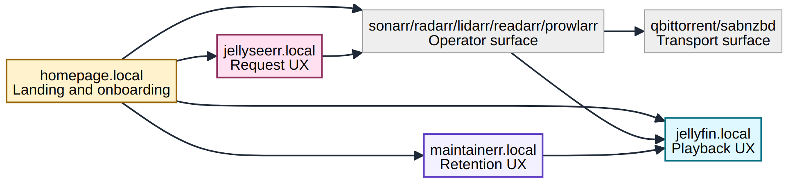

# Service Guide

Reference authenticated screenshots:
- [Homepage](screenshots/apps/homepage_local.png)
- [Jellyfin](screenshots/apps/jellyfin_local.png)
- [Jellyseerr](screenshots/apps/jellyseerr_local.png)
- [Maintainerr](screenshots/apps/maintainerr_local.png)

## Pluggable Role Mapping

Service roles are binding-driven from `technology_bindings`:
- `media_server`
- `request_manager`
- `torrent_client`
- `usenet_client`

The examples below describe the default stack selection, but runtime orchestration is manifest-driven and can be swapped without editing shared runner code.

## Jellyfin
Primary media server. Reads finalized media from `/media/*` and renders it to clients.

## Jellyseerr
Request UI. Sends movie/show requests to Radarr/Sonarr and shows availability from Jellyfin.

## Prowlarr
Central indexer manager. Sonarr/Radarr/Lidarr/Readarr receive indexers from Prowlarr app links.

## Sonarr / Radarr / Lidarr / Readarr
Automation managers for TV, movies, music, and books.
They search via Prowlarr, send downloads to the active torrent/usenet clients, then import into `/media/*`.
Bootstrap also enforces CDH + hardlink-friendly media management and quality-profile preference (1080p then 720p fallback for Sonarr/Radarr), plus quality-upgrade lifecycle stop conditions (default blocks 4K tiers).
Radarr TMDb discovery lists are configured OTB for self-filling libraries (Trending/Popular/Top Rated/Upcoming).
They are not full library groomers for stale/old content; for deeper lifecycle pruning use a policy tool such as Maintainerr.

## Bazarr
Subtitle automation.
Bootstrap wires Bazarr to Sonarr and Radarr via Bazarr config-as-code.
Bazarr does not integrate with Lidarr/Readarr (music/books) because subtitle automation is for movies/TV content.
Bazarr also does not directly connect to qBittorrent or SABnzbd; download client wiring remains in the Arr apps.

## qBittorrent
Torrent downloader. Receives jobs from Arr and stores into `/data/torrents/*`.
It is not a Jellyfin library source directly.
This stack can enforce seeding limits and cleanup behavior from config-as-code (ratio/time + optional disk guardrails).
It also supports scheduled IP blocklist refresh (`media_hygiene.qbit_ipfilter`) with cached fallback if the upstream list is temporarily unavailable.

## SABnzbd
Usenet downloader. Receives jobs from Arr and stores into `/data/usenet/*`.
It is also not a Jellyfin library source directly.

## Grooming / Retention Layer
Recommended best-practice split:
- Arr stack: acquisition and import orchestration.
- torrent/usenet transport clients: lifecycle cleanup.
- Dedicated groomer policy tool (Maintainerr): library retention based on watch/use rules.

In other words, no single Arr app is the full groomer. Use the layered approach above.

This stack ships:
- downloader-side cleanup defaults (CDH + qB seeding/cleanup policy)
- disk-usage guardrails (`disk_guardrails` in `contracts/media-stack.config.json`, default max 65% used on `/srv-stack/media`)
- scheduled media hygiene (`media_hygiene`) for failed queue cleanup + temp/orphan cleanup
- Jellyfin prewarm schedule (`jellyfin_prewarm`) for recurring metadata/artwork + guide/channel refresh
- Maintainerr app route (`maintainerr.<domain>`) with persistent config (`/opt/data`)
- Maintainerr policy-as-code file generation (`maintainerr` -> `/srv-config/maintainerr/policy.json`)

## Unpackerr
Watches completed download folders and unpacks for the arr apps.
Bootstrap now syncs Arr API keys into secret config and restarts Unpackerr automatically when the deployment is active (replicas > 0).

## Homepage
Single-pane dashboard.
Bootstrap generates Homepage `services.yaml` from active ingress hosts so app links are auto-populated.

## Maintainerr
Retention policy UI and API for media lifecycle operations.
Deployed in full/public-demo/power-user profiles and exposed at `maintainerr.<domain>`.
Bootstrap now reconciles Maintainerr main settings (`applicationUrl`, media-server type, Jellyfin URL/API key/user, Seerr URL)
plus integrations for Radarr, Sonarr, Jellyseerr, and Tautulli with API-level test calls.
Policy rules are maintained as a config-as-code library (one file per rule) under
`src/media_stack/contracts/maintainerr_rules/{json,yaml}/` and rendered to `/srv-config/maintainerr/policy.json`.

## Controller
Persistent HTTP API service for stack configuration and operational control.
Exposes an interactive dashboard, action dispatch, SSE log streaming, webhook notifications,
runtime config toggles, and action retry on port 9100.
Available at `controller.local`, `controller.<stack>.local`, or `/app/controller`.

## Envoy
Edge gateway proxy for path-prefix and host-based routing.
Automatically configured by the controller service from the bootstrap profile.
Every app gets three route patterns: `app.local`, `app.<stack>.local`, and `/app/<name>`.

## Tautulli
Media analytics and monitoring. Runs in the default compose and K8s standard profiles.

## Plex / FlareSolverr
Optional extras.
When FlareSolverr is enabled in bootstrap config, bootstrap reconciles a Prowlarr FlareSolverr indexer proxy and runs a proxy connection test automatically.

---

**Project Steward**
Matthew Loschiavo • [matthewloschiavo.com](https://matthewloschiavo.com) • [mploschiavo@gmail.com](mailto:mploschiavo@gmail.com) • [LinkedIn](https://www.linkedin.com/in/matthewloschiavo)
